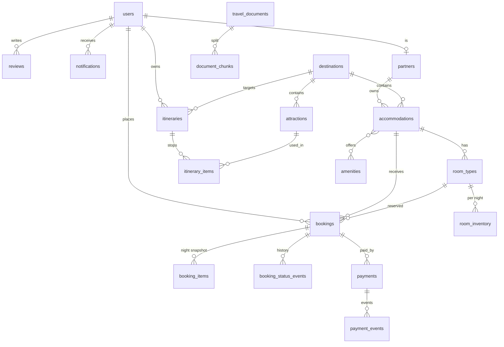

# Database ERD

```mermaid
erDiagram
  users ||--o{ bookings : places
  users ||--o{ reviews : writes
  users ||--o{ itineraries : owns
  users ||--o{ notifications : receives
  users ||--o| partners : is
  partners ||--o{ accommodations : owns
  destinations ||--o{ accommodations : contains
  destinations ||--o{ attractions : contains
  destinations ||--o{ itineraries : targets
  accommodations ||--o{ room_types : has
  room_types ||--o{ room_inventory : "per night"
  accommodations ||--o{ bookings : receives
  room_types ||--o{ bookings : reserved
  bookings ||--o{ booking_items : "night snapshot"
  bookings ||--o{ booking_status_events : history
  bookings ||--o{ payments : paid_by
  payments ||--o{ payment_events : events
  itineraries ||--o{ itinerary_items : stops
  attractions ||--o{ itinerary_items : used_in
  travel_documents ||--o{ document_chunks : split
  accommodations }o--o{ amenities : offers
```
