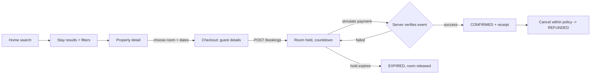
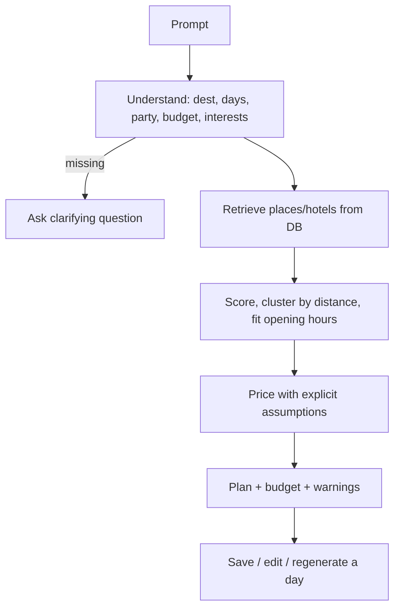

# User flows

```mermaid
flowchart LR
  A[Home search] --> B[Stay results + filters]
  B --> C[Property detail]
  C -->|choose room + dates| D[Checkout: guest details]
  D -->|POST /bookings| E[Room held, countdown]
  E -->|simulate payment| F{Server verifies event}
  F -->|success| G[CONFIRMED + receipt]
  F -->|failed| E
  E -->|hold expires| H[EXPIRED, room released]
  G --> I[Cancel within policy -> REFUNDED]
```

```mermaid
flowchart TD
  P[Prompt] --> U[Understand: dest, days, party, budget, interests]
  U -->|missing| Q[Ask clarifying question]
  U --> R[Retrieve places/hotels from DB]
  R --> S[Score, cluster by distance, fit opening hours]
  S --> T[Price with explicit assumptions]
  T --> V[Plan + budget + warnings]
  V --> W[Save / edit / regenerate a day]
```
